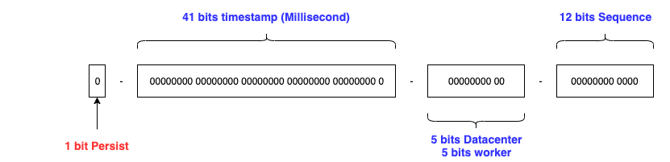

# snowflake

Twitter snowflake worker - Twitter雪花ID计算器

[twitter announcing](https://blog.twitter.com/engineering/en_us/a/2010/announcing-snowflake.html)


## Introduction

The default Twitter format shown below.



* Default: 1-41-10(5-5)-12, time accurecy is millsecond
* [Baidu-Generator](https://github.com/baidu/uid-generator): 1-28-22-13, time accurecy is second
* nodeBits = DatacenterBits + workerBits

### Usage

import trellis.tech/common.v2/snowflake

```go


// You can set your epoch time
// but do not set the time before 69 years ago, then you should get the overflowed number

worker, _ := snowflake.NewWorker()  // below pow(2, nodeBits) = 1024

// get by for
id := worker.Next()

// get by sleep until Millisecond
id = worker.NextSleep()
```

### Benchmark

```go
go test -bench=. -benchmem  -run=none

goos: darwin
goarch: amd64
pkg: trellis.tech/common.v2/snowflake
cpu: Intel(R) Core(TM) i7-7700HQ CPU @ 2.80GHz
BenchmarkNext-8                   	 4927034	     244.1 ns/op	       0 B/op	       0 allocs/op
BenchmarkNextMaxSequence-8        	 9595654	     119.1 ns/op	       0 B/op	       0 allocs/op
BenchmarkNextNoSequence-8         	    1213	    998895 ns/op	       0 B/op	       0 allocs/op
BenchmarkNextSleep-8              	     934	   1375943 ns/op	       0 B/op	       0 allocs/op
BenchmarkNextSleepMaxSequence-8   	 9475443	     119.6 ns/op	       0 B/op	       0 allocs/op
BenchmarkNextSleepNoSequence-8    	     914	   1367458 ns/op	       0 B/op	       0 allocs/op
PASS
ok  	trellis.tech/common.v2/snowflake	8.104s

goos: darwin
goarch: amd64
pkg: trellis.tech/common.v2/snowflake
cpu: VirtualApple @ 2.50GHz
BenchmarkNext-10                    	 4931802	     244.0 ns/op	       0 B/op	       0 allocs/op
BenchmarkNextMaxSequence-10         	19899342	     59.60 ns/op	       0 B/op	       0 allocs/op
BenchmarkNextNoSequence-10          	    1219	    998952 ns/op	       0 B/op	       0 allocs/op
BenchmarkNextSleep-10               	 4119868	     375.4 ns/op	       0 B/op	       0 allocs/op
BenchmarkNextSleepMaxSequence-10    	17207970	     58.34 ns/op	       0 B/op	       0 allocs/op
BenchmarkNextSleepNoSequence-10     	    1066	   1160042 ns/op	       0 B/op	       0 allocs/op
PASS
ok  	trellis.tech/common.v2/snowflake	8.529s
```